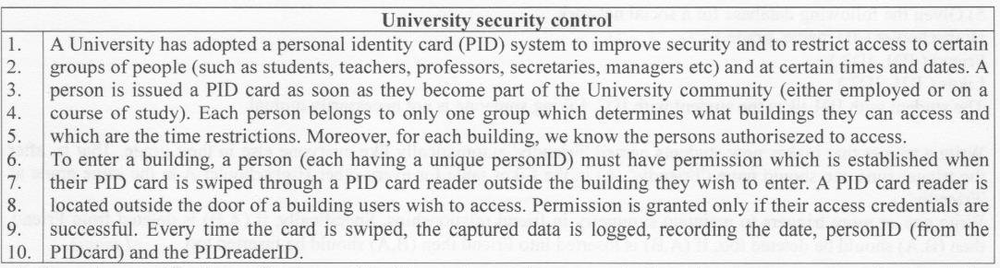
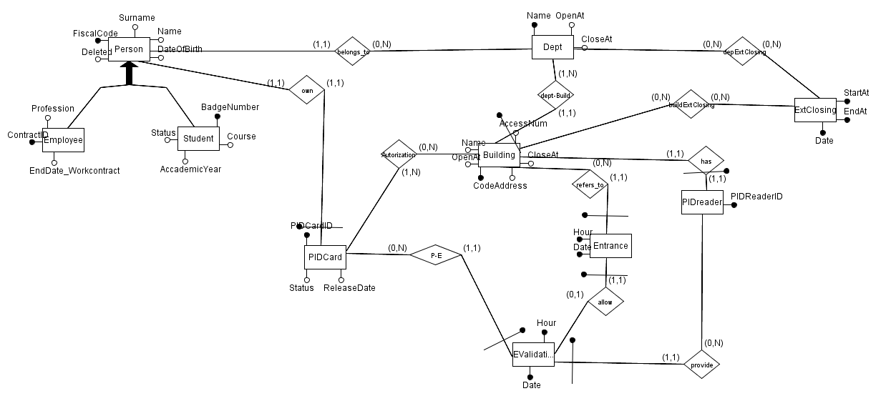

# University-Security-Control
This repo contains the project's contents (code + documentation) devivered for an exam named **Database System**.
I attended this exam during my M.S. in Computer science (LM-18),  at the University of Bari "Aldo Moro".
I took the exam on **the second of February 2018**.

Duration: November, 2017 - January, 2018 (3 months)

# Table of contents
 * [Introduction](#introduction)
 * [Requirements](#requirements)
 * [EER](#eer)
 * [Running](#running)

## Introduction

## Requirements

## EER

## Running
Import sql file into oracle developer and run it into a your schema.

then exec populate_database;
Note: it will take about 10 minutes to populate. 

import the project and change the credential in the class DAO.

## Author
**Francesco Giannico**, M.S. in Computer Science, specialized in Knowledge Engineering and Machine intelligence (LM-18)
* [github/francesco-giannico](https://github.com/francesco-giannico)
* [linkedin/francesco-giannico](https://linkedin.com/in/francesco-giannico)

## Collaborators
* [Michelangelo ceci](http://www.di.uniba.it/~ceci/), Full Professor at [University of Bari "Aldo Moro"](https://www.uniba.it/)
